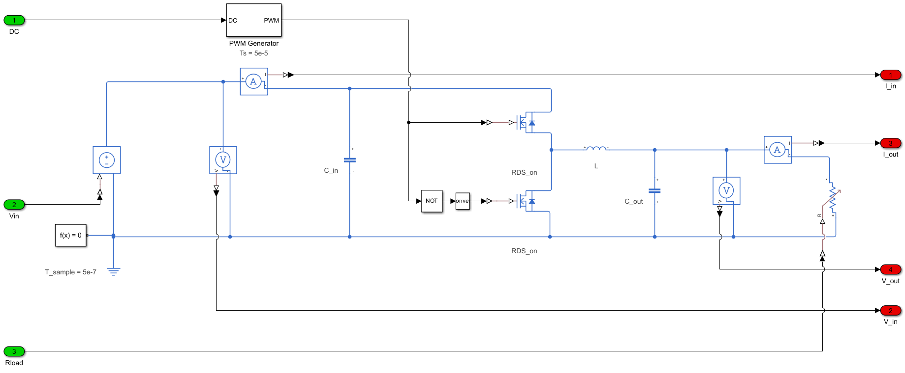

# The system being modelled

The Simthetic Buck ROM is trained on the synchronous DCDC buck converter shown below: two complementarily-driven MOSFETs (10 kHz PWM, no dead-time), a step-down inductor, an output capacitor, and a variable resistive load.



## Design point

| Quantity | Value | Notes |
|---|---|---|
| Switching frequency `f_s` | 10 kHz | Fixed |
| Nominal `V_in` | 40 V | Used to dimension L and C_out |
| Nominal `V_out` | 16 V | Design target |
| Inductor current ripple `ΔI_L` | 1 A peak-to-peak | Design constraint |
| Output voltage ripple `ΔV_out` | 1 V peak-to-peak | Design constraint |

## Component values

| Component | Value | Comment |
|---|---|---|
| `C_in` | 1 µF | Input bypass capacitor |
| `L` | ≈ 1 mH | Computed: `L = V_out · (V_in − V_out) / (ΔI_L · f_s · V_in) ≈ 0.96 mH` |
| `C_out` | 12.5 µF | Computed: `C_out = ΔI_L / (8 · f_s · ΔV_out)` |
| `R_load` | 0.5 Ω (nominal) | Variable in the live demo — see envelope below |

All passives are treated as ideal (zero DCR, zero ESR).

## MOSFET model

Both M1 (high-side) and M2 (low-side) use Simscape's **Ideal-Switching MOSFET** block with an integral body diode (no dynamics):

| Parameter | Value |
|---|---|
| `R_DS(on)` | 10 mΩ |
| Gate threshold `V_th` | 0.5 V |
| Off-state conductance | 1 µS |
| Body diode forward voltage `V_f` | 0.8 V |
| Body diode on-resistance `R_on` | 1 mΩ |
| Body diode off-conductance | 10 µS |
| Dead-time | **0** (M2 driven by the complement of the PWM signal — `NOT(PWM)`) |
| Thermal port | Disabled |

No switching-transition dynamics are modelled — no gate capacitance, no `Q_g`, no turn-on / turn-off delays. The ROM operates at `dt = 50 µs`, two orders of magnitude above the switching period, and captures the averaged behaviour rather than the instantaneous switching waveform.

## Live demo operating envelope

The ROM is trained and validated over:

- `V_in ∈ [10, 45] V`
- `R_load ∈ [1, 10] Ω`
- Duty cycle `DC ∈ [0.2, 0.8]`

Outside this envelope the ROM extrapolates; accuracy is not guaranteed.

## Reproducing in your own simulator

The design point above comes from this MATLAB script:

```matlab
Vin       = 40;          % V
Vout      = 16;          % V (target)
fs        = 10000;       % Hz
deltaIL   = 1;           % A peak-to-peak inductor ripple
deltaVout = 1;           % V peak-to-peak output ripple
Rload     = 0.5;         % Ω (nominal)
V_Cin     = 40;          % V (initial Cin voltage)

DT   = Vout / (Vin * 0.9);                          % design duty, 0.9 efficiency margin → 0.444
L    = Vout * (Vin - Vout) / (deltaIL * fs * Vin);  % ≈ 0.96 mH
Cout = deltaIL / (8 * fs * deltaVout);              % 12.5 µF
```

`C_in = 1 µF` and the MOSFET parameters above are set directly on the Simscape blocks rather than computed from the design formulas.

If you build an equivalent model in another tool (LTspice, PLECS, PSIM, Modelica), use the same component values, the same complementary-switching scheme with **zero dead-time**, and the same ideal-MOSFET assumptions. The reference Simscape traces in [`benchmarks/simscape_outputs/`](../benchmarks/simscape_outputs/) are what your simulator should produce on the [published benchmark input vectors](../benchmarks/input_vectors/).
